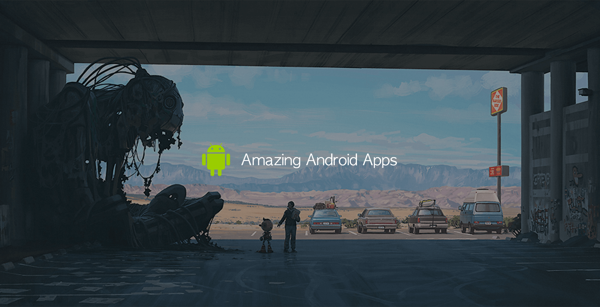

# Amazing open source Android apps
</a>

This is “amazing” series of open source projects. See the post published with images: [here](https://medium.mybridge.co/38-amazing-android-open-source-apps-java-1a62b7034c40)

This is an extremely competitive list of open source Android apps written in Java. It carefully picks the best Android apps written in Java that are open source. To give you an idea about the quality of this list, <b>the average number of Github stars is 3,874.</b>

The apps are broken down into 13 groups: Social Networking, News, Photos & Videos, Productivity, Music, Game, Messaging, Media, Finance, Architecture, Utilities, Reference, Weather.

[Mybridge](https://www.mybridge.co) initially picked the apps. You're welcome to contribute. Let's make sure the quality of app is great.

 

## Learn
If you want to learn how to develop an Android app, these courses are recommended

No 1) [Android & Java Beginner: Mobile App Development: Go from beginner to paid professional app developer.](http://bit.ly/2ynlxYB) 14,018 recommends, 4.7/5 stars

No 2) [Kotlin for Android: Beginner to Advanced.](http://bit.ly/2k2cFU2) 1,893 recommends, 4.6/5 stars

 

## Amazing Apps
#### Social Networking
* [Android-oss: Official Kickstarter open source app for Android. Bring new ideas to life, anywhere. ★4,233](https://github.com/kickstarter/android-oss?utm_source=mybridge&utm_medium=email&utm_campaign=read_more)

* [NewPipe: A lightweight Youtube frontend for Android. ★2,597](https://github.com/TeamNewPipe/NewPipe?utm_source=mybridge&utm_medium=email&utm_campaign=read_more)

* [Official WordPress App for Android - Wordpress Engineering. ★1597](https://github.com/wordpress-mobile/WordPress-Android?utm_source=mybridge&utm_medium=email&utm_campaign=read_more)

#### News
* [Plaid: An Android app which provides design news & inspiration as well as being an example of implementing material design. ★10,235](https://github.com/nickbutcher/plaid?utm_source=mybridge&utm_medium=email&utm_campaign=read_more)

* [FastHub: The ultimate GitHub client for Android. ★2,468](https://github.com/k0shk0sh/FastHub?utm_source=mybridge&utm_medium=email&utm_campaign=read_more)

* [Materialistic: A material-design Hacker News Android reader. ★1,429](https://github.com/hidroh/materialistic?utm_source=mybridge&utm_medium=email&utm_campaign=read_more)

#### Photos & Videos
* [Telecine: Record full-resolution video on your Android devices. ★2,127](https://github.com/JakeWharton/Telecine?utm_source=mybridge&utm_medium=email&utm_campaign=read_more)

* [LeafPic: An ad-free, open-source and material-designed android gallery alternative. ★2,061](https://github.com/HoraApps/LeafPic?utm_source=mybridge&utm_medium=email&utm_campaign=read_more)

#### Productivity
* [K-9 Mail: Advanced Email for Android. ★3,488](https://github.com/k9mail/k-9?utm_source=mybridge&utm_medium=email&utm_campaign=read_more)

* [The ownCloud Android App: Organize and Store everything. ★2,343](https://github.com/owncloud/android?utm_source=mybridge&utm_medium=email&utm_campaign=read_more)

* [AmazeFileManager: Material design file manager for Android. ★1,611](https://github.com/TeamAmaze/AmazeFileManager?utm_source=mybridge&utm_medium=email&utm_campaign=read_more)

* [Omni-Notes: Open source note-taking application for Android. ★1,213](https://github.com/federicoiosue/Omni-Notes?utm_source=mybridge&utm_medium=email&utm_campaign=read_more)

#### Music
* [Timber: Material Design Music Player. ★3,813](https://github.com/naman14/Timber?utm_source=mybridge&utm_medium=email&utm_campaign=read_more)

* [Phonograph: A material designed music player for Android ★1,502](https://github.com/kabouzeid/Phonograph?utm_source=mybridge&utm_medium=email&utm_campaign=read_more)

* [Shuttle Music Player. ★1,475](https://github.com/timusus/Shuttle?utm_source=mybridge&utm_medium=email&utm_campaign=read_more)

* [Vanilla: A Music Player with Plugins. ★472](https://github.com/vanilla-music/vanilla?utm_source=mybridge&utm_medium=email&utm_campaign=read_more)

#### Game
* [Pixel-dungeon: Traditional roguelike game with pixel-art graphics and simple interface. ★1,758](https://github.com/watabou/pixel-dungeon?utm_source=mybridge&utm_medium=email&utm_campaign=read_more)

* [Santa-tracker-android: An entertaining app that brings joy to millions of children on Christmas - Google Engineering. ★1,147](https://github.com/google/santa-tracker-android?utm_source=mybridge&utm_medium=email&utm_campaign=read_more)

* [2048-android: The android port of the 2048 game (for offline playing). ★606](https://github.com/uberspot/2048-android?utm_source=mybridge&utm_medium=email&utm_campaign=read_more)

#### Messaging
* [Telegram for Android source: A messaging app focused on speed and security. ★8,614](https://github.com/DrKLO/Telegram?utm_source=mybridge&utm_medium=email&utm_campaign=read_more)

* [Signal-Android: A private messenger for Android. ★8,523](https://github.com/WhisperSystems/Signal-Android?utm_source=mybridge&utm_medium=email&utm_campaign=read_more)

* [Qksms: The most beautiful SMS messenger app for Android. ★1,676](https://github.com/moezbhatti/qksms?utm_source=mybridge&utm_medium=email&utm_campaign=read_more)

* [ExoPlayer: An extensible media player for Android - Google Engineering. ★8,555](https://github.com/google/ExoPlayer?utm_source=mybridge&utm_medium=email&utm_campaign=read_more)

#### Media
* [VLC media player official for Android App. ★3,365](https://github.com/videolan/vlc?utm_source=mybridge&utm_medium=email&utm_campaign=read_more)

* [AntennaPod: A podcast manager for Android. ★1,728](https://github.com/AntennaPod/AntennaPod?utm_source=mybridge&utm_medium=email&utm_campaign=read_more)

* [MovieGuide: Movie discovery app showcasing MVP, RxJava, Dagger 2 and Clean Architecture. ★1,657](https://github.com/esoxjem/MovieGuide?utm_source=mybridge&utm_medium=email&utm_campaign=read_more)

#### Finance
* [CoCoin: Multi-view Accounting Application for Android. ★1,698](https://github.com/Nightonke/CoCoin?utm_source=mybridge&utm_medium=email&utm_campaign=read_more)

* [Kickmaterial: Crowdfunding app concept for Android built on Material Design. ★1,461](https://github.com/byoutline/kickmaterial?utm_source=mybridge&utm_medium=email&utm_campaign=read_more)

* [Bitcoin Wallet Android: Standalone Bitcoin node, no centralized backend required. ★1,079](https://github.com/bitcoin-wallet/bitcoin-wallet?utm_source=mybridge&utm_medium=email&utm_campaign=read_more)

* [GnuCash Android: A companion expense-tracker application. ★690](https://github.com/codinguser/gnucash-android?utm_source=mybridge&utm_medium=email&utm_campaign=read_more)

* [StocksWidget - A home screen widget that displays stock price quotes from your portfolio. ★107](https://github.com/premnirmal/StockTicker?utm_source=mybridge&utm_medium=email&utm_campaign=read_more) <b> - Kotlin </b>

#### Architecture
* [Android-CleanArchitecture: A sample app on how to architect an android app using Uncle Bob's clean architecture approach. ★10,476](https://github.com/android10/Android-CleanArchitecture?utm_source=mybridge&utm_medium=email&utm_campaign=read_more)

* [Archi: Showcase of 3 Android app architectures: Standard Android" ★3,046](https://github.com/ivacf/archi?utm_source=mybridge&utm_medium=email&utm_campaign=read_more)

* [Android-mvvm-architecture: A detailed sample app that implements MVVM architecture using Dagger2, Room, RxJava2, FastAndroidNetworking and PlaceholderView. ★2,147](https://github.com/MindorksOpenSource/android-mvp-architecture?utm_source=mybridge&utm_medium=email&utm_campaign=read_more)

#### Utilities
* [Shadowsocks client: A secure socks5 proxy. Surf the internet privately and securely. ★10,893](https://github.com/shadowsocks/shadowsocks-android?utm_source=mybridge&utm_medium=email&utm_campaign=read_more)

* [SoundRecorder: A simple sound recording app implementing Material Design. ★626](https://github.com/dkim0419/SoundRecorder?utm_source=mybridge&utm_medium=email&utm_campaign=read_more)

#### Reference
* [iosched: The Google I/O 2017 Android App. ★15,197](https://github.com/google/iosched?utm_source=mybridge&utm_medium=email&utm_campaign=read_more)

* [Apps-android-wikipedia: The official Wikipedia Android open source app. ★600](https://github.com/wikimedia/apps-android-wikipedia?utm_source=mybridge&utm_medium=email&utm_campaign=read_more)

#### Weather
* [SeeWeather: RxJava+RxBus+Retrofit+Glide+Material Design Weather App. ★3,003](https://github.com/xcc3641/SeeWeather?utm_source=mybridge&utm_medium=email&utm_campaign=read_more)

